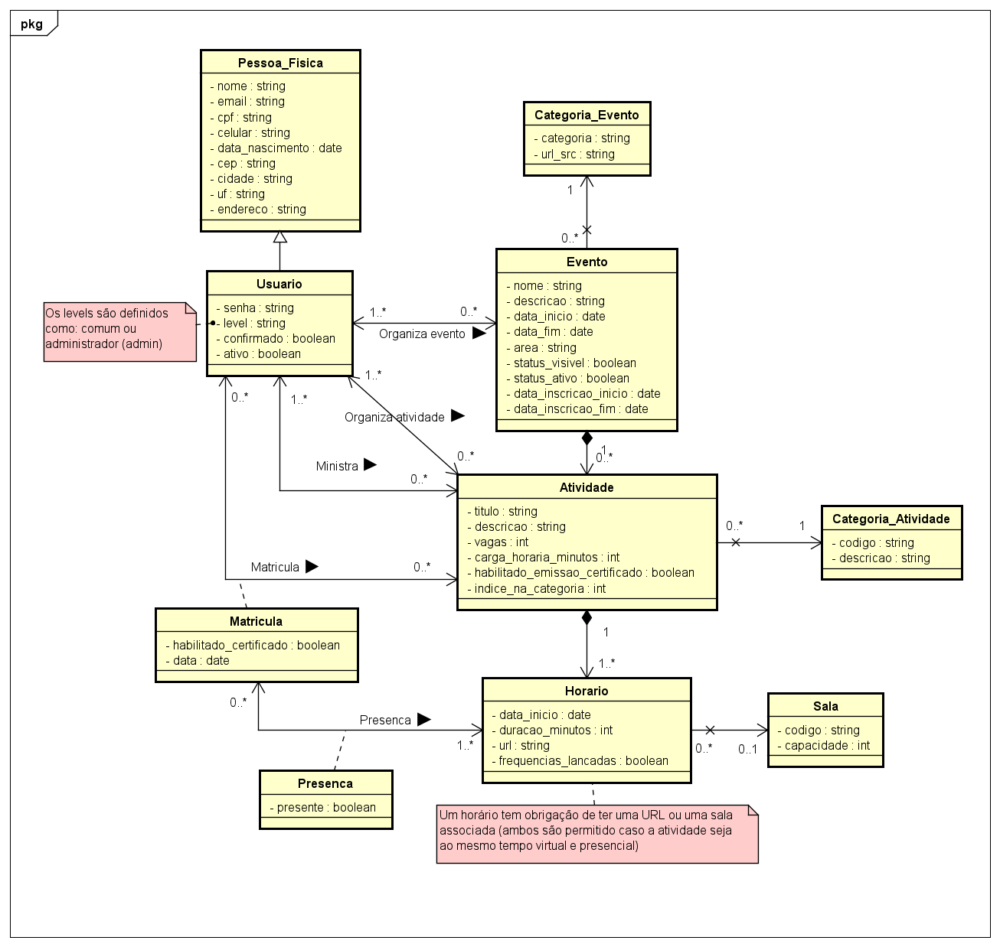
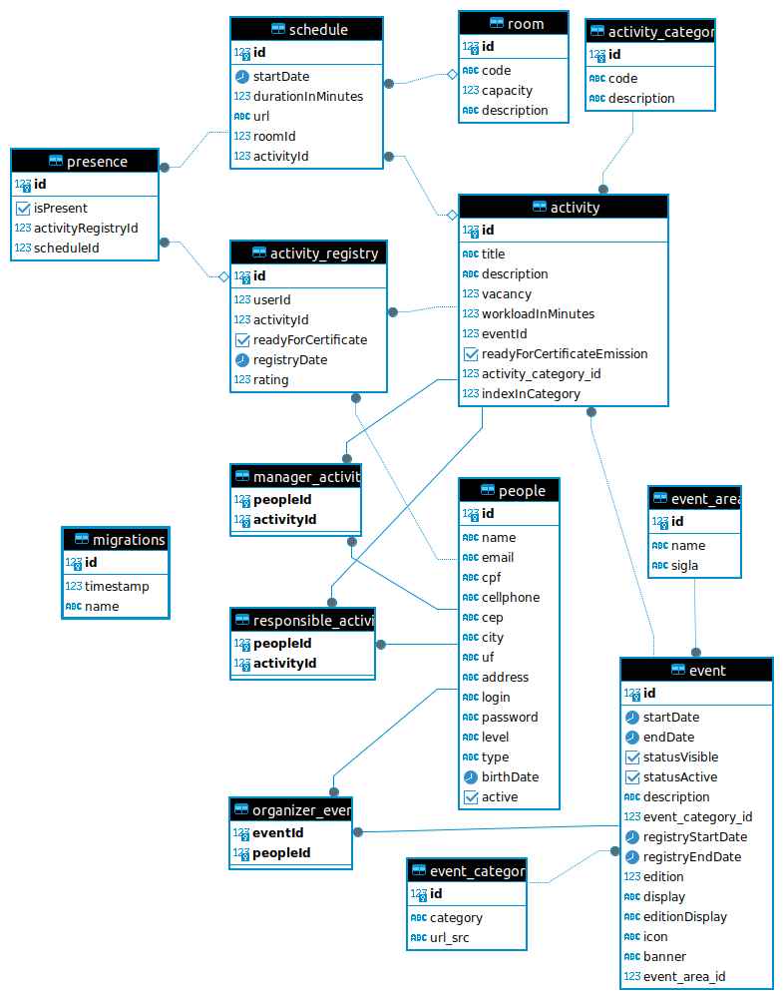
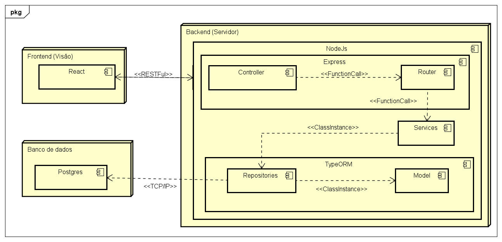

# Manual do Sistema Gerenciador de Eventos

## Regras de negócio

### Usuário comum

#### Geral

- Ao criar uma conta, o usuário já estará apto para utilizar o sistema.
- A partir da tela de login, pode recuperar a sua senha através do e-mail cadastrado.
- Um usuário comum será elegível para receber certificado de um evento se:
    - Participou de ao menos X horas de várias atividades, com a quantidade de horas sendo definida pelo instituto e organizadores do evento.
    - Concluiu todas as presenças em uma atividade (uma atividade pode ter mais de um horário, e portanto precisa estar presente em todos os horários)

#### Eventos e inscrições

- Só pode visualizar eventos que estejam visíveis.
- Só pode visualizar as atividades dos eventos que estejam ativos.
- É possível que ocorra conflito de horários se duas atividades ocorrerem no mesmo horário (ou em horários sobrepostos). Se for o caso, ele não poderá se inscrever nas duas atividades simultaneamente (independente de ser presencial ou virtual).

#### Visualização de matrículas

- Pode filtrar as suas matrículas em um evento ativo.
- Pode visualizar os eventos ativos em que está participando, vendo as atividades desses eventos.
- Pode visualizar os eventos anteriores em que participou, vendo o histórico de atividade desses eventos anteriores.

### Responsável pela atividade

#### Atividades de edições presentes ou futuras

- Pode consultar e alterar as suas atividades.
- Apenas pode alterar o nome, descrição, ministrantes, vagas, horário e carga horária da atividade.
- Também é responsável por gerenciar as presenças de cada uma das suas atividades, seguindo as regras abaixo:
    - Pode marcar, para cada participante, se ele compareceu ou faltou em uma data específica.
    - Pode inscrever qualquer usuário, contanto que não ocorra conflito de horário com outra atividade.
    - Pode remover a inscrição de qualquer participante nos casos de inscrição errada ou de quando o usuário se cadastra em uma atividade mas participa de outra no mesmo horário da primeira, para não haver conflito de horário na hora de gerar o certificado da atividade que o usuário participou.
    - Só é possível emitir uma presença para uma data se a data já teve início.
    - Só pode concluir a atividade após o início da última data da atividade.
    - Pode alterar a ação de concluir a atividade, caso alguma presença tenha sido lançada erroneamente, mas não é possível cancelar a conclusão de uma atividade.
- Pode gerar um relatório de participantes de cada uma ou de todas as atividades, tendo em formato PDF as presenças de cada participante. Se a data da atividade ainda não ocorreu, então será marcada como "A ocorrer".
- Pode gerar um relatório de participantes de cada uma ou de todas as atividades, tendo em formato XLSX as presenças de cada participante. Esse relatório contém apenas os participantes que assinaram a lista de presenças.

#### Atividades de edições anteriores

- Pode consultar e alterar as suas atividades.
- Apenas pode alterar o nome, descrição, ministrantes, vagas e carga horária da atividade.
- É possível que, mesmo após a edição finalizar, o responsável não tenha emitido presenças. Nesse caso, o mesmo ainda pode gerenciar as presenças de acordo com as seguintes regras:
    - Pode marcar, para cada participante, se ele compareceu ou faltou em uma data específica.
    - Pode inscrever qualquer usuário, contanto que não ocorra conflito de horário com outra atividade.
    - Pode remover a inscrição de qualquer participante nos casos de inscrição errada ou de quando o usuário se cadastra em uma atividade mas participa de outra no mesmo horário da primeira, para não haver conflito de horário na hora de gerar o certificado da atividade que o usuário participou.
    - Pode alterar a ação de concluir a atividade, caso alguma presença tenha sido lançada erroneamente, mas não é possível cancelar a conclusão de uma atividade.
- Pode gerar um relatório de participantes de cada uma ou de todas as atividades, tendo em formato PDF as presenças de cada participante. Se a data da atividade ainda não ocorreu, então será marcada como "A ocorrer".
- Pode gerar um relatório de participantes de cada uma ou de todas as atividades, tendo em formato XLSX as presenças de cada participante. Esse relatório contém apenas os participantes que assinaram a lista de presenças.

### Organizador do evento

#### Edições presentes ou futuras

- Pode consultar e alterar as suas edições.
- A data da edição só pode ser alterada se os dois requisitos forem cumpridos:
    - Não possui nenhuma atividade.
    - Ainda não iniciou.
- É capaz de controlar a programação da edição:
    - Pode cadastrar novas atividades.
    - Pode consultar e alterar todas as atividades da edição.
    - Não consegue cadastrar ou alterar uma atividade se:
        - A atividade tem conflito de horário e sala com outra atividade.
        - A atividade tem conflito de ministrante no mesmo horário e sala com outra atividade.
    - Pode excluir atividades se:
        - Não tem ninguem matriculado.
        - A edição ainda não iniciou.
    - Pode gerar um relatório de participantes de cada uma ou de todas as atividades, tendo em formato PDF as presenças de cada participante. Se a data da atividade ainda não ocorreu, então será marcada como "A ocorrer".
    - Pode gerar a lista de presenças, tendo em formato PDF o nome, CPF e um campo para as assinaturas dos participantes, para que posteriormente a lista seja passada nas salas em que as atividades estão ocorrendo.
- Pode gerar dois tipos de relátorio filtrado pela quantidade de horas que o participante acumulou com as atividades:
    - Relatório detalhado de participantes de cada uma das edições, tendo todas as atividades que o participante se matriculou naquela edição e as suas presenças.
    - Relatório resumido de participantes de cada uma das edições, tendo a carga horária total que o participante acumulou.

#### Edições anteriores

- Pode consultar e alterar as suas edições (a data da edição não pode ser alterada)
- É capaz de visualizar a programação da edição:
    - Pode cadastrar novas atividades.
    - Pode consultar e alterar todas as atividades da edição.
    - Não consegue cadastrar uma atividade se:
        - A atividade tem conflito de horário e sala com outra atividade.
        - A atividade tem conflito de ministrante no mesmo horário e sala com outra atividade.
    - Não pode alterar a data
    - Pode gerar um relatório de participantes de cada uma das atividades, tendo em formato PDF as presenças de cada participante.
- Pode gerar dois tipos de relátorio filtrado pela quantidade de horas que o participante acumulou com as atividades:
    - Relatório detalhado de participantes de cada uma das edições, tendo todas as atividades que o participante se matriculou naquela edição e as suas presenças.
    - Relatório resumido de participantes de cada uma das edições, tendo a carga horária total que o participante acumulou.

#### Atividades de edições presentes ou futuras

- Pode consultar e alterar todas as atividades.
- Pode gerenciar as presenças de cada uma das atividades, seguindo as regras abaixo:
    - Pode marcar, para cada participante, se ele compareceu ou faltou em uma data específica.
    - Pode inscrever qualquer usuário, contanto que não ocorra conflito de horário com outra atividade.
    - Pode remover a inscrição de qualquer participante nos casos de inscrição errada ou de quando o usuário se cadastra em uma atividade mas participa de outra no mesmo horário da primeira, para não haver conflito de horário na hora de gerar o certificado da atividade que o usuário participou.
    - Só é possível emitir uma presença para uma data se a data já teve início.
    - Só pode concluir a atividade após o início da última data da atividade.
    - Pode alterar a ação de concluir a atividade, caso alguma presença tenha sido lançada erroneamente, mas não é possível cancelar a conclusão de uma atividade.
- Pode gerar um relatório de participantes de cada uma ou de todas as atividades, tendo em formato PDF as presenças de cada participante. Se a data da atividade ainda não ocorreu, então será marcada como "A ocorrer".
- Pode gerar um relatório de participantes de cada uma ou de todas as atividades, tendo em formato XLSX as presenças de cada participante. Esse relatório contém apenas os participantes que assinaram a lista de presenças.

#### Atividades de edições anteriores

- Pode consultar e alterar todas as atividades.
- É possível que, mesmo após a edição finalizar, as presenças ainda não tenham sido emitidas. Nesse caso, o organizador pode gerenciar as presenças de acordo com as seguintes regras:
    - Pode marcar, para cada participante, se ele compareceu ou faltou em uma data específica.
    - Pode inscrever qualquer usuário, contanto que não ocorra conflito de horário com outra atividade.
    - Pode remover a inscrição de qualquer participante nos casos de inscrição errada ou de quando o usuário se cadastra em uma atividade mas participa de outra no mesmo horário da primeira, para não haver conflito de horário na hora de gerar o certificado da atividade que o usuário participou.
    - Pode alterar a ação de concluir a atividade, caso alguma presença tenha sido lançada erroneamente, mas não é possível cancelar a conclusão de uma atividade.
- Pode gerar um relatório de participantes de cada uma ou de todas as atividades, tendo em formato PDF as presenças de cada participante. Se a data da atividade ainda não ocorreu, então será marcada como "A ocorrer".
- Pode gerar um relatório de participantes de cada uma ou de todas as atividades, tendo em formato XLSX as presenças de cada participante. Esse relatório contém apenas os participantes que assinaram a lista de presenças.

### Administrador

#### Edições

- Pode consultar, cadastrar, alterar e excluir.
- Apenas pode excluir uma edição se:
    - Não possui nenhuma atividade.
- A data da edição só pode ser alterada se:
    - Não possui nenhuma atividade.
    - Ainda não iniciou.
- É capaz de controlar a programação da edição:
    - Pode cadastrar novas atividades.
    - Pode consultar e alterar todas as atividades da edição.
    - Não consegue cadastrar ou alterar uma atividade se:
        - A atividade tem conflito de horário e sala com outra atividade.
        - A atividade tem conflito de ministrante no mesmo horário e sala com outra atividade.
    - Pode excluir atividades se:
        - Não tem ninguém matriculado.
        - A edição ainda não iniciou.
    - Pode gerar um relatório de participantes de cada uma das atividades, tendo em formato PDF as presenças de cada participante. Se a data da atividade ainda não ocorreu, então será marcada como "A ocorrer".
    - Pode gerar a lista de presenças, tendo em formato PDF o nome, cpf e um campo para as assinaturas dos participantes, para que posteriormente a lista seja passada nas salas em que as atividades estão ocorrendo.
- Pode gerar dois tipos de relátorio filtrado pela quantidade de horas que o participante acumulou com as atividades:
    - Relatório detalhado de participantes de cada uma das edições, tendo todas as atividades que o participante se matriculou naquela edição e as suas presenças.
    - Relatório resumido de participantes de cada uma das edições, tendo a carga horária total que o participante acumulou.

#### Edições anteriores

- Pode consultar e alterar todas as edições.
- A data da edição não pode ser alterada.
- É capaz de visualizar a programação da edição:
    - Pode cadastrar novas atividades.
    - Pode consultar e alterar todas as atividades da edição.
    - Não consegue cadastrar uma atividade se:
        - A atividade tem conflito de horário e sala com outra atividade.
        - A atividade tem conflito de ministrante no mesmo horário e sala com outra atividade.
    - Não pode alterar a data
    - Pode gerar um relatório de participantes de cada uma das atividades, tendo em formato PDF as presenças de cada participante.
- Pode gerar dois tipos de relátorio filtrado pela quantidade de horas que o participante acumulou com as atividades:
    - Relatório detalhado de participantes de cada uma das edições, tendo todas as atividades que o participante se matriculou naquela edição e as suas presenças.
    - Relatório resumido de participantes de cada uma das edições, tendo a carga horária total que o participante acumulou.

### Salas

- Pode consultar, cadastrar, alterar e excluir.
- Só pode excluir se não há nenhuma atividade cadastrada para essa sala.

### Eventos

- Pode consultar, cadastrar, alterar e excluir.
- Só pode excluir se não há nenhuma edição cadastrada para esse evento.

### Categorias da atividade

- Pode consultar, cadastrar, alterar e excluir.
- Só pode excluir se não há nenhuma atividade cadastrada para essa categoria.

### Áreas

- Pode consultar, cadastrar, alterar e excluir.
- Só pode excluir se não há nenhuma edição cadastrada para essa área.

### Usuários

- Pode consultar, cadastrar, alterar e desativar.
- Apenas pode alterar o nome, e-mail, celular, endereço e senha.
- Apenas pode desativar o usuário se:
    - O usuário não é organizador nem responsável por alguma edição que está ocorrendo no momento, ou uma edição futura.

## Escopo do sistema

O Sistema Gerenciador de Eventos é uma plataforma desenvolvida pelos alunos do curso de Ciências da Computação para administrar e facilitar a gestão dos eventos dentro do câmpus da faculdade. Com o objetivo de proporcionar uma experiência eficiente e conveniente, o sistema oferece funcionalidades de autenticação e contas de usuário, visualização de eventos e inscrições, gestão de certificados, controle de atividades para responsáveis, acesso privilegiado para organizadores e permissões abrangentes para o administrador. Essas funcionalidades visam garantir a segurança, eficiência e organização na gestão dos eventos realizados na faculdade.

### Autenticação e Contas de Usuário

- Os usuários podem registrar suas contas fornecendo informações básicas.
- Opção de login utilizando e-mail e senha ou CPF e senha.
- Recuperação de senha através do serviço de e-mail registrado.
- Os usuários podem alterar os dados cadastrados, exceto CPF e data de nascimento.
- Necessidade de fornecer uma data de nascimento válida.
- Restrições de acesso a determinadas funcionalidades com base no tipo de usuário.

### Eventos e Inscrições

- Visualização dos eventos disponíveis.
- Atividades relacionadas aos eventos ativos.
- Verificação da elegibilidade dos participantes para obtenção de certificados.
- Verificação e controle de possíveis conflitos de horários nas inscrições.
- Histórico completo das atividades realizadas, incluindo eventos anteriores.

### Responsáveis pelas Atividades

- Consulta e alteração das atividades presentes e futuras.
- Gerenciamento de presenças em cada atividade.
- Geração de relatórios detalhados de participantes e presenças.

### Organizadores do Evento

- Consulta e alteração das edições presentes e futuras em que organiza.
- Controle da programação da edição do evento.
- Cadastro, alteração e exclusão de atividades.
- Relatórios completos de participantes e presenças.

### Administrador

- Gerenciamento abrangente de edições, salas, eventos, categorias de atividades e usuários.
- Controle total da programação das edições, incluindo cadastro e alteração de atividades.
- Gerenciamento de presenças e geração de relatórios.
- Alteração e desativação de usuários com base em critérios específicos.

## Documentação

### Diagrama de classes

### Modelo de dados

### Diagrama navegacional

#### Externo

#### Interno

### Diagrama de arquitetura

	
